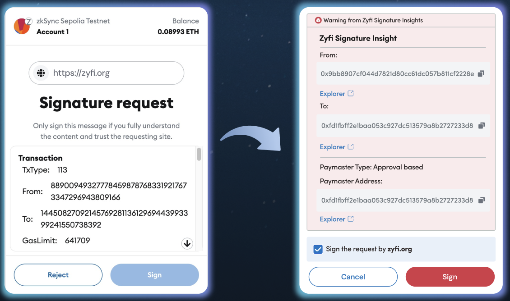

# Zyfi Paymaster Insight Snap

This snap provides signature insights for the paymaster transaction type : 113 on ZKsync ecosystem. This snap supports following ZKevm Elastic Chains: ZKsync Era, ZKsync Sepolia Testnet, Cronos ZKevm Mainnet, Cronos ZKevm Testnet, Abstract Chain Testnet.

## What problem does this snap solve? 

With this snap, paymaster transactions type: 113  on ZKsync becomes readable. This way, users can ensure the important details of the type: 113 transactions such as "From" address, "To" address, "Paymaster" address etc. of the signature  before signing them.

